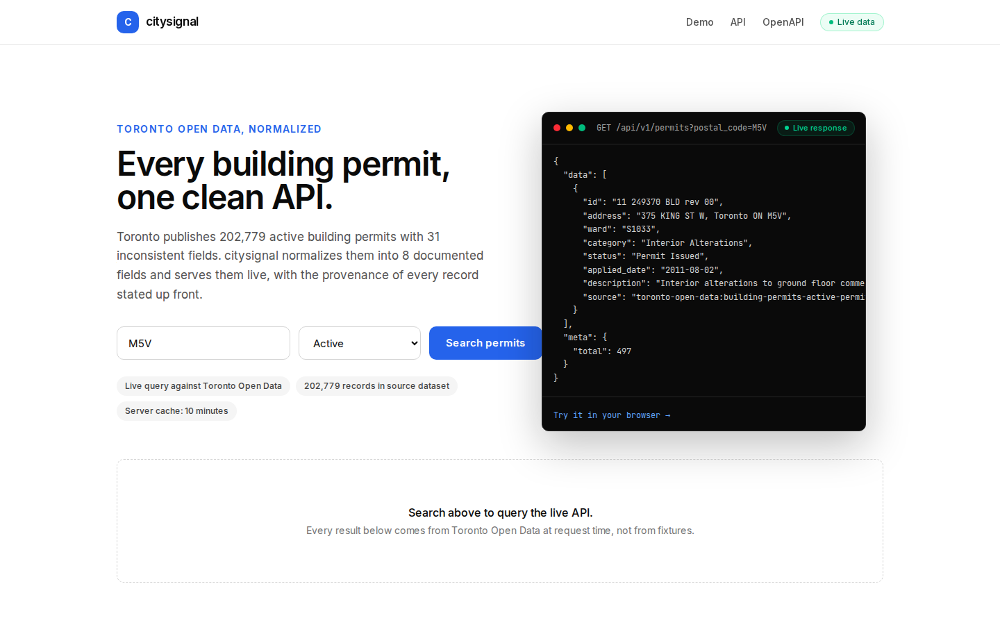
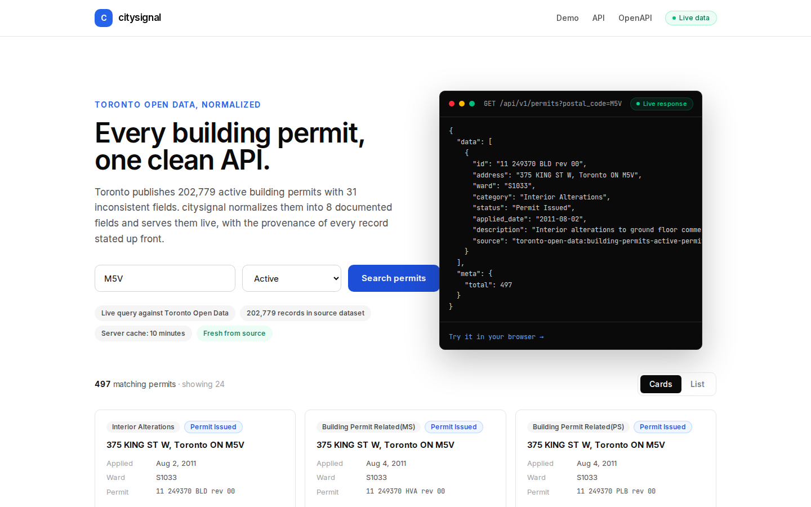
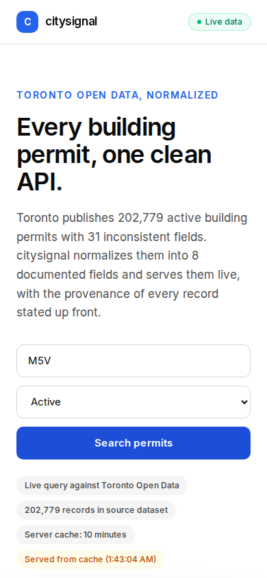

# citysignal

One clean API over Toronto's messy open data. citysignal normalizes the city's
202,779 active building permits (31 inconsistent raw fields) into 8 documented
fields and serves them live, with provenance stated on every record.





## What it does

Toronto's open data portal publishes building permits with inconsistent naming,
casing, and 31 fields per record. citysignal queries the city's CKAN datastore
live, normalizes each record into `{ id, address, ward, category, status,
applied_date, description, source }`, and serves it through a documented REST
API plus a demo UI. The normalization is the product; the UI proves it.

## Honest data labeling

- **Live data:** every permit record is queried from Toronto Open Data at
  request time. The UI shows a "Live data" badge and each API response carries
  `meta.provenance` with the source dataset, record count at query time, and a
  note describing what was normalized.
- **Cached:** responses are cached server-side for 10 minutes. Cached responses
  say so explicitly (`provenance.cached: true` with `cached_at`), and the UI
  shows a "Served from cache" badge instead of "Fresh from source".
- **Sampled:** the API pulls up to 500 records per CKAN query and filters
  precisely in memory; `meta.total` reports matches within that pull, and
  `meta.limit` caps the response at 100. This is a v1 tradeoff, documented in
  the OpenAPI doc, not a full-table scan.

Values are verbatim from the source. Field names are the only thing
citysignal changes.

## API

Base URL: `https://city.nshipyard.com` (local dev: `http://localhost:3000`).

### Search permits

`GET /api/v1/permits?postal_code=M5V&status=active&limit=20`

| Param | Description |
| ----- | ----------- |
| `postal_code` | Forward sortation area prefix, e.g. `M5V`. Matches the start of the postal code. |
| `status` | `active` (excludes abandoned and revoked permits) or a substring such as `Permit Issued`. |
| `q` | Full-text search across the source record (street name, description, builder). |
| `limit` | 1 to 100. Default 20. |

```bash
curl "https://city.nshipyard.com/api/v1/permits?postal_code=M5V&status=active&limit=5"
```

### Get one permit

`GET /api/v1/permits/{id}` with the city permit number, e.g.
`/api/v1/permits/11%20249370%20BLD`. Returns 404 for unknown ids.

### Machine-readable docs

- OpenAPI 3.1: `GET /api/openapi.json`
- Health: `GET /api/health`

## Configuration

No environment variables are required. No API keys. The app calls the public
Toronto Open Data CKAN endpoint directly:

- `https://ckan0.cf.opendata.inter.prod-toronto.ca/api/3/action/datastore_search`
- Resource: `building-permits-active-permits` (`6d0229af-bc54-46de-9c2b-26759b01dd05`)

Tunable constants live in `lib/toronto.ts`: `CACHE_TTL_MS` (10 minutes),
the CKAN page size (500), and the `INACTIVE_STATUSES` set used by the
`status=active` filter.

## Development

```bash
npm install
npm run dev      # http://localhost:3000
npm run lint     # must be clean
npm run build    # must be clean
```

Product review cycle (16 checks: API contract, desktop and mobile browser
behavior, zero console errors):

```bash
npm run build && (npx next start -p 3105 &) && sleep 6
node scripts/review-cycle.mjs
```

## Project structure

- `lib/toronto.ts` - CKAN client, record normalizer, 10-minute server cache
- `app/api/v1/permits/route.ts` - `GET /api/v1/permits`
- `app/api/v1/permits/[id]/route.ts` - `GET /api/v1/permits/{id}`
- `app/api/openapi.json/route.ts` - OpenAPI 3.1 document
- `app/page.tsx` - demo UI (search, cards/list views, API docs)
- `scripts/review-cycle.mjs` - product review cycle

## Roadmap

v1 covers building permits only. The schema is designed to extend: 311
service requests and business licences are the next two resources, each
normalized into the same `{ id, address, ward, category, status,
applied_date, description, source }` shape.

## Author

Built by **Richardson Dackam** - https://x.com/richardsondx ·
https://github.com/richardsondx

## License

MIT. Data: City of Toronto, under the city's open data licence.
